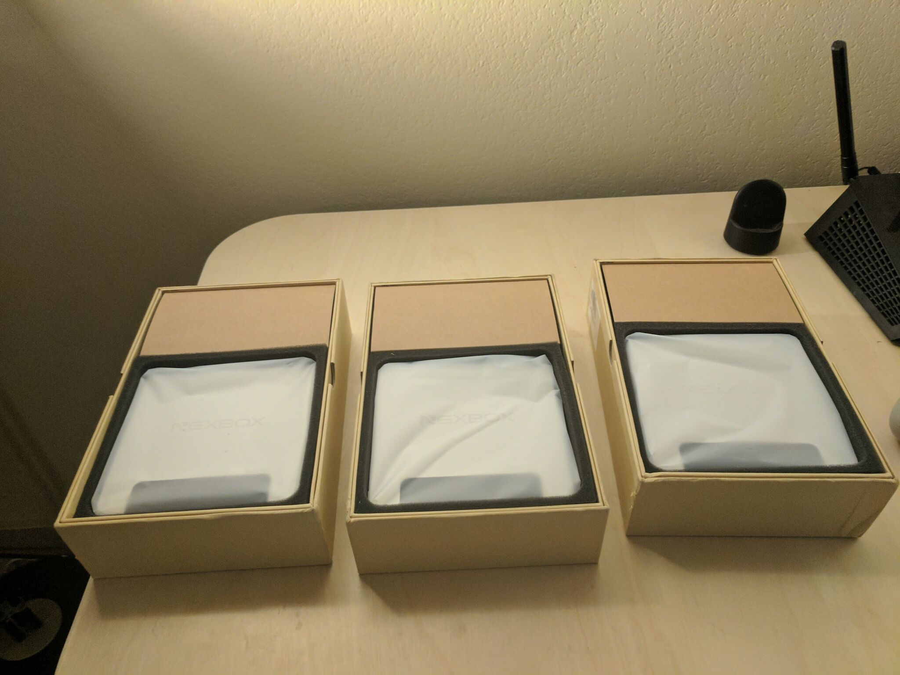
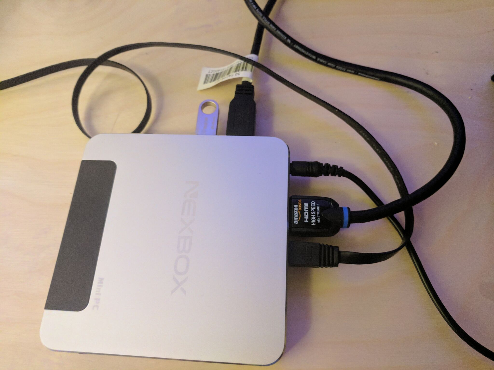
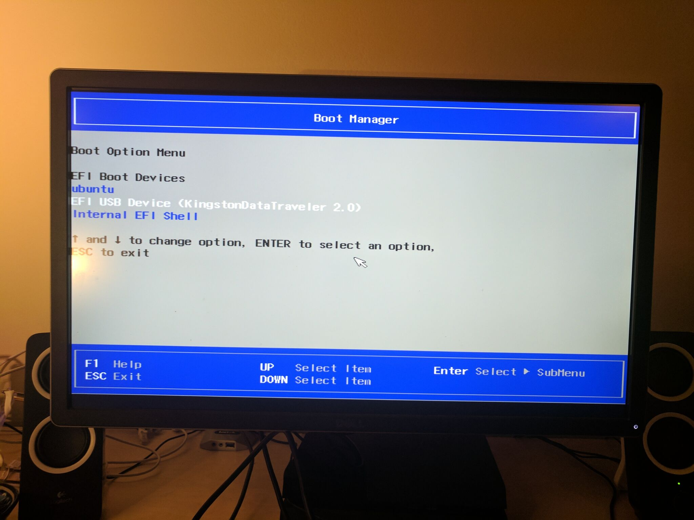
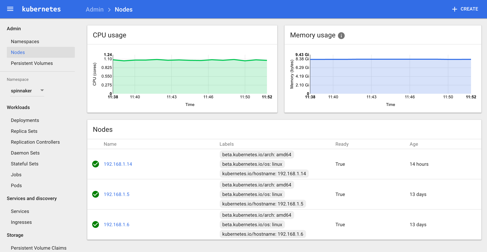
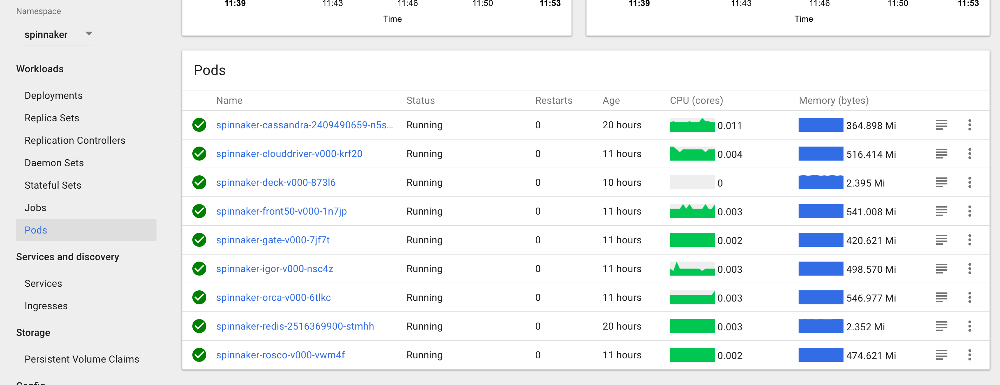
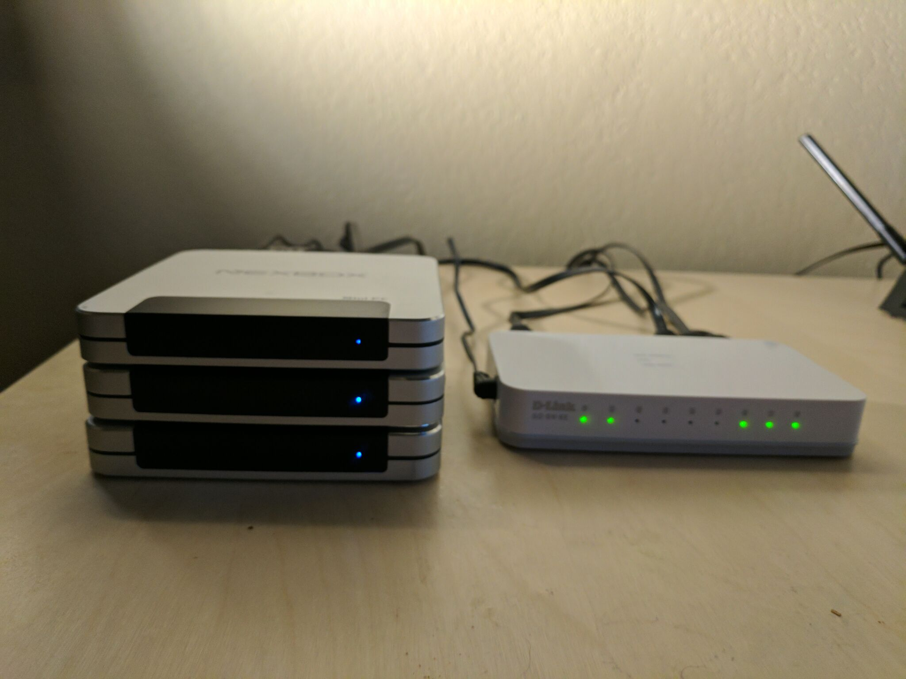

# Creating a Spinnaker applicance with Kubernetes

This guide will cover how I created a bare-metal continuous-delivery applicance using Spinnaker, running on a Kubernetes cluster of "mini pcs".

The first version of this guide can be found here: https://hackernoon.com/diy-kubernetes-cluster-with-x86-stick-pcs-b0b6b879f8a7

## What is Spinnaker?

http://www.spinnaker.io/ is set of microservices that make it easy to build continuous delivery pipelines. Contributers to the project include Netflix, Google, Microsoft and Kenzan. 

The project brings together best practices and patterns for easily deploying immuatable infastructure style software. Deploy targets can be instances or containers running on a multitude of platforms including AWS, GCP, Azure and Kubernetes. 

## Why Kubernetes?

Spinnaker can be run from any of the above platforms, however due to the nature of the resources needed it can be quite expensive. Kubernetes allows us to set up our own "cloud" on bare metal. We can then use our Spinnaker instance to easily deploy to other cloud platforms or clusters. It's also pretty neat having a self contained "appliance" running Spinnaker. Hardware prices are contantly falling and it is pretty fun experimenting with software on our own "datacenter". 

## Choosing hardware

While I was able to get the cluster turned up with the first version of this guide, The "Stick pcs" proved to be too weak on the memory requirement. I needed nodes that had at least 4gb memory. After some searching I decided on three "nexbox" pcs.

https://www.aliexpress.com/store/product/1Set-Nexbox-T9-Smart-TV-Box-Z8300-1-84GHz-4-Cores-Win-10-Mini-PC-4GB/2130214_32658221265.html

* 4GB memory
* Quad core atom processor
* 64GB SSD
* Ethernet port

It took a while for the boxes to arrive from Aliexpress but I was excited to get started when they did.



## Installing Ubuntu

Unlike the tv-sticks, these boxes came with windows installed. That was no good for the cluster so I began by trying to install ubuntu server. Unfortunatley since the chipset in these machines was "cherry trail" it had limited linux compatability. The nic did not work at all during install.

Thankfully after some searching I was able to find an ubuntu image with a modifed kernal to support the chipset. http://linuxiumcomau.blogspot.com/search?updated-min=2017-01-01T00:00:00%2B11:00&updated-max=2018-01-01T00:00:00%2B11:00&max-results=2

Burning the image to a thumb drive I was then able to hold the ESC key and boot from the drive to install.



With ubuntu installed on the boxes I was now able to install docker on each node.

## Installing Kubernetes

```
apt-get update
apt-get install docker.io 
```

I then leveraged the docker-multinode scripts to get kubernetes installed along with heapster and the dashboard.

https://github.com/kubernetes/kube-deploy

Installation is relativly simple, you run the master.sh script on one node and worker.sh on the remaining two nodes.

Tunneling 8080 into the master node and the dashboard displayed like a charm.



## Installing Spinnaker

I then was able to make some minor modifications to the "spinikube" specs and get spinnaker installed.

https://github.com/kenzanlabs/spinikube




Overall I am very happy with how the cluster turned out. It's great to be able to have a dedicated cluster without wasting resources on vms. I'm looking forward to running more workloads and monitoring performance.



Next steps to experiment with include getting persistent volume storage in place with ceph or gluster. It will be great to take advantage of all the storage on the nodes. 