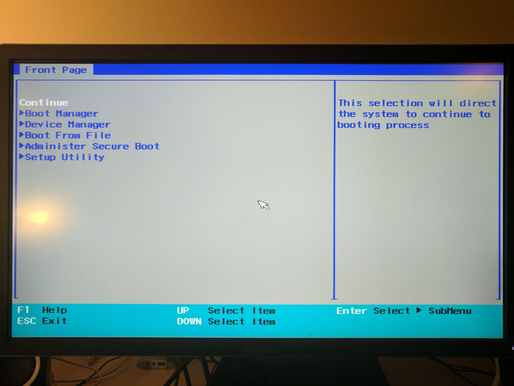

# Creating a Spinnaker applicance with Kubernetes

This guide will cover how I created a bare-metal continuous-delivery applicance using Spinnaker, Kubernetes and some inexpensive "mini pcs".

The first version of this guide can be found here: https://hackernoon.com/diy-kubernetes-cluster-with-x86-stick-pcs-b0b6b879f8a7

While I was able to get the cluster turned up. The "Stick pcs" proved to be too weak on the memory requirement. I needed nodes that had at least 4gb memory. After some searching I decided on three "nexbox" pcs.

https://www.aliexpress.com/store/product/1Set-Nexbox-T9-Smart-TV-Box-Z8300-1-84GHz-4-Cores-Win-10-Mini-PC-4GB/2130214_32658221265.html

* 4GB memory
* Quad core atom processor
* 64GB SSD

It took a while for the boxes to arrive from Aliexpress but I was excited to get started when they did.


Unlike the tv-sticks, these boxes came with windows installed. That was no good for the cluster so I began by trying to install ubuntu server. Unfortunatley since the chipset in these machines was "cherry trail" it had limited linux compatability. The nic did not work at all during install.

Thankfully after some searching I was able to find an ubuntu image with a modifed kernal to support the chipset. http://linuxiumcomau.blogspot.com/search?updated-min=2017-01-01T00:00:00%2B11:00&updated-max=2018-01-01T00:00:00%2B11:00&max-results=2



With ubuntu installed on the boxes I was now able to install docker on each node.

```
apt-get update
apt-get install docker.io 
```

I then leveraged the docker-multinode scripts to get kubernetes installed along with heapster and the dashboard.

https://github.com/kubernetes/kube-deploy

Tunneling 8080 into the master node and the dashboard displayed like a charm.


I then was able to make some minor modifications to the "spinikube" specs and get spinnaker installed.

https://github.com/kenzanlabs/spinikube


Overall I am very happy with how the cluster turned out. It's great to be able to have a dedicated cluster without wasting resources on vms. I'm looking forward to running more workloads and monitoring performance.

